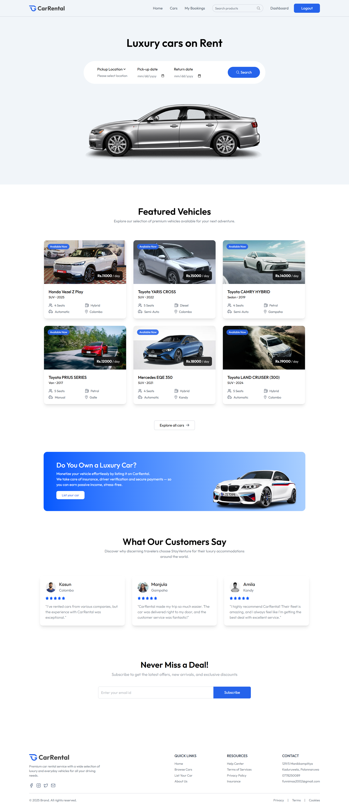
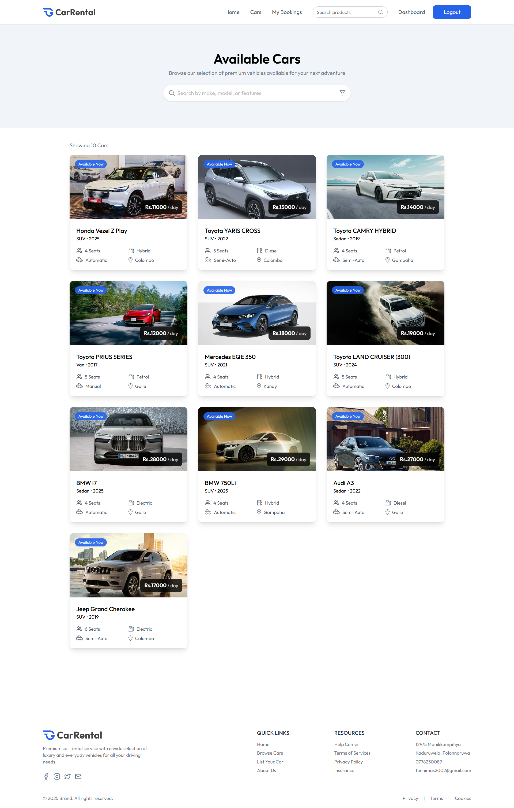
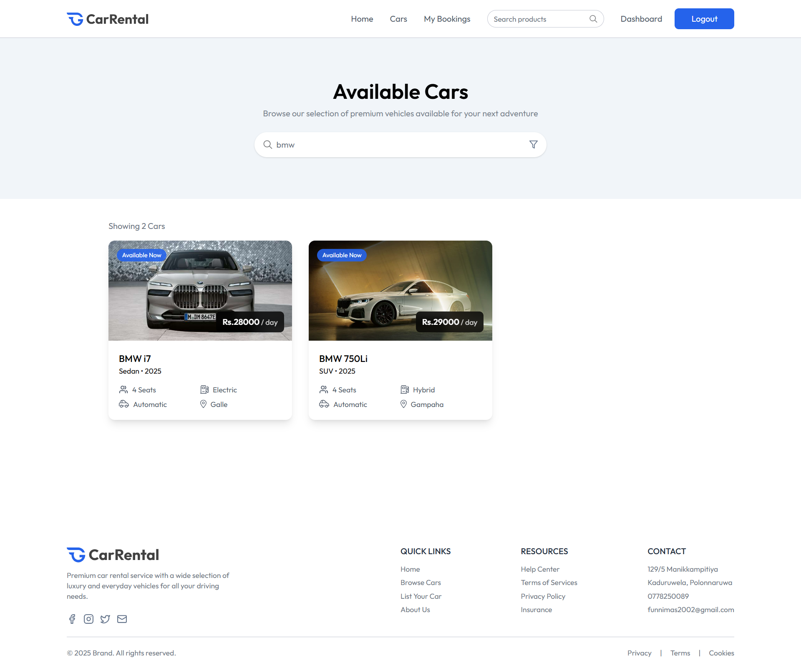
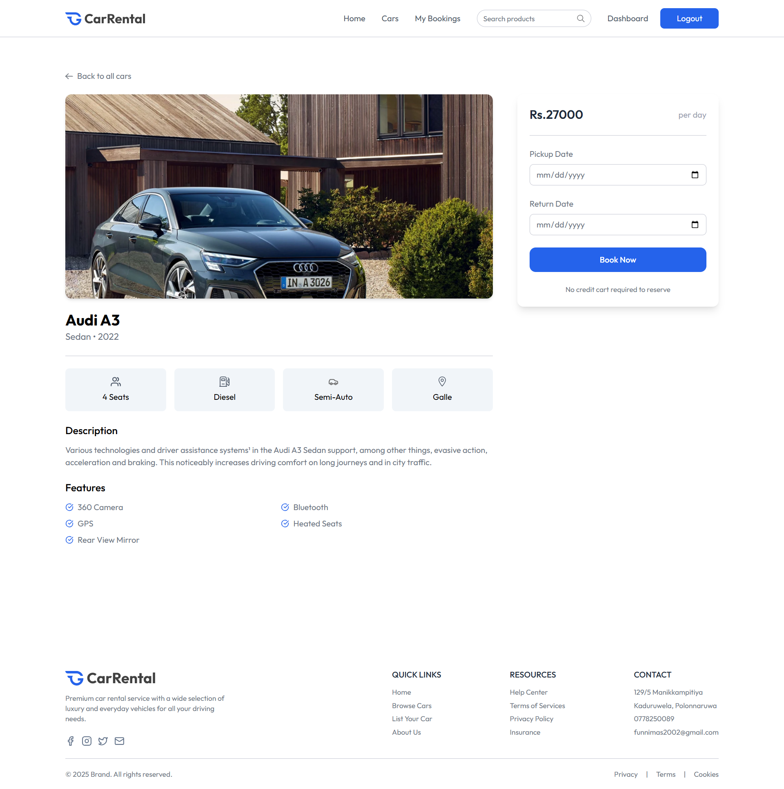
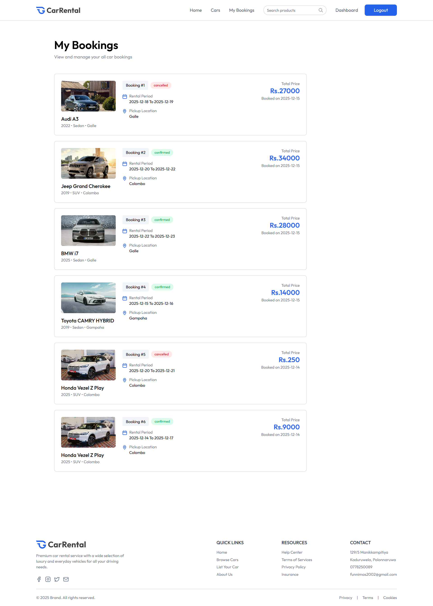

# 🚗 Car Rental Website

A full-stack modern car rental application built with the **MERN Stack**. This platform allows users to browse cars, view details, and book vehicles, while providing robust authentication and seamless image management.

## 📸 Screenshots

**Home Page**


**Cars Page**


**Search**


**car-detail Page**


**my-bookings Page**


## ✨ Key Features

- **User Authentication & Authorization**

  -Secure user registration and login

  -JWT-based authentication

  -Password hashing with bcrypt

  -Protected routes and role-based access

- **Car Management**

  -Browse available cars with detailed information

  -Advanced search and filtering options

  -High-quality car images with Cloudinary integration

  -Real-time availability status

- **Responsive Design**

  -Mobile-first approach with Tailwind CSS

  -Smooth animations using Framer Motion

  -Modern and intuitive user interface

- **User Experience**

  -Real-time notifications with React Hot Toast

  -Fast and responsive interactions

  -Seamless navigation

---

## 🛠️ Tech Stack

### **Frontend**

- **React.js**: Library for building the user interface.

- **Tailwind CSS**: Utility-first CSS framework for styling.

- **Axios**: HTTP client.

- **React Hot Toast**: Toast notifications.

### **Backend**

- **Node.js**: Runtime environment.

- **Express.js**: Web framework for the API.

- **MongoDB**: NoSQL database for storing user and listing data.

- **Mongoose**: ODM (Object Data Modeling) library for MongoDB.

### **Security & Storage**

- **Cloudinary**: Cloud storage service for property images.

- **Multer**: File upload handling.

- **JWT (JSON Web Tokens)**: For secure user authentication.

- **Bcrypt.js**: For password hashing and security.

---

## 🚀 Getting Started

Follow these steps to set up the project locally.

### Prerequisites

Make sure you have the following installed:

- [Node.js](https://nodejs.org/) (v14 or higher)
- [npm](https://www.npmjs.com/) or [yarn](https://yarnpkg.com/)
- [MongoDB](https://www.mongodb.com/) (Local or Atlas URL)
- [Cloudinary Account](https://cloudinary.com/) (Free tier available)

### Installation

1.  **Clone the repository**

        First, clone the repository:

    [Car Rental Repo](https://github.com/Kafoor-Nimas/CarRental.git)

````bash
git clone https://github.com/Kafoor-Nimas/CarRental.git
cd car-rental
    ```

2.  **Install Backend Dependencies**

    ```bash
    # Assuming you are in the root directory
    cd server
    npm install
    ```

3.  **Install Frontend Dependencies**
    ```bash
    cd client
    npm install
    ```

### Environment Configuration

1. Create a `.env` file in your **root** directory and add the following variables:

   ```env
   MONGO_URI=your_mongodb_connection_string
   JWT_SECRET=your_secret_key
   PORT=3000

   # Cloudinary Configuration
   CLOUDINARY_CLOUD_NAME=your_cloud_name
   CLOUDINARY_API_KEY=your_api_key
   CLOUDINARY_API_SECRET=your_api_secret
````

2. Create a `.env` file in your **client** directory for Firebase:

   ```env
   VITE_CURRENCY=your_country_currency
   VITE_FIREBASE_API_KEY=your_firebase_api_key
   ```

### Running the App

1. **Start the Backend Server**

   ```bash
   cd server
   npm run start
   # or for development with nodemon
   npm run server
   ```

2. **Start the Client**

   ```bash
   cd client
   npm run dev
   ```

Visit `http://localhost:5173` (or your configured port) to view the app.

The application will be available at:

Frontend: http://localhost:5173

Backend: http://localhost:3000

---

## 📞 Contact

**Nimas Kafoor**

- **Email:** [nimaskafoor@gmail.com](mailto:nimaskafoor@gmail.com)
- **GitHub:** [github.com/Kafoor-Nimas](https://github.com/Kafoor-Nimas)
- **LinkedIn:** [linkedin.com/in/nimas-kafoor](https://www.linkedin.com/in/nimas-kafoor)
